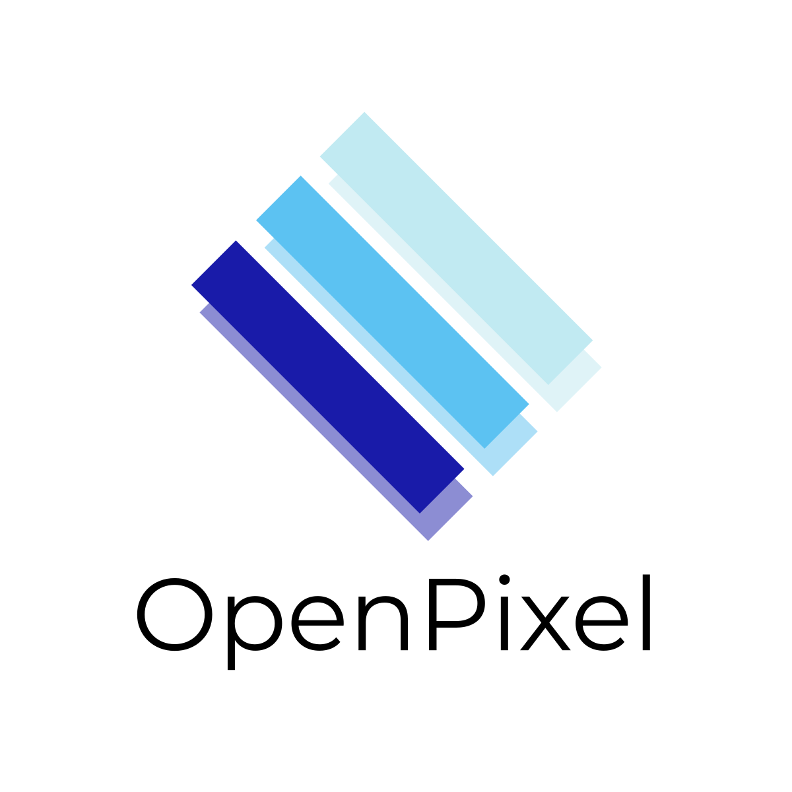

    

   

- 语言 : [English](../README.md) | **简体中文**

# OpenPixel - The Display Protocol

## OpenPixel是什么？
OpenPixel是一个给CoolPotOS用的显示协议。\
它易于使用且具备高度可移植性。\
OpenPixel提供 C 语言基础库和 Lua 扩展库支持。\
查阅《[OpenPixel 库函数API表](https://linzhichen114.github.io/~openpixel/docs/libraries/table.html)》开始使用。
<!--
## 构建

## 移植
阅读《[OpenPixel 移植手册](https://linzhichen114.github.io/~openpixel/docs/porting.html)》，该文档将指导你如何将OpenPixel移植到其他操作系统或其他硬件平台。 -->

## 贡献
欢迎通过提交Pull Request或Issue参与本项目建设。
